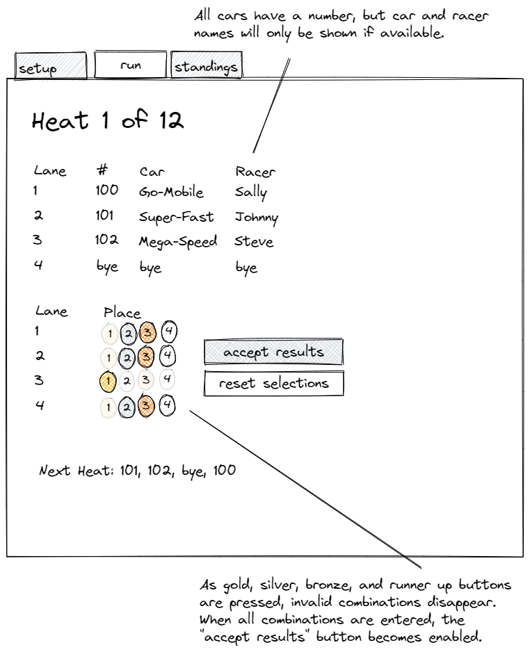

# Racing Web

Racing Web is an online tool for generating race schedules, and running the races live from a computer or smartphone.

## Usage

## Schedule Generation

This generator attempts to accomplish the following (in priority order) for a points-based derby.

1. Ignore extra lanes when the number of lanes exceeds the number of cars
2. Each car will race in each lane
3. The number of heats is the same as the number of cars
4. All lanes are used in each heat
5. Heats are re-ordered to _try_ and avoid a car racing in two heats in a row

The default race generation method is a simple left rotation, as shown in the following 9 car, 3 lane schedule:

    1 2 3
    2 3 4
    3 4 5
    4 5 6
    5 6 7
    6 7 8
    7 8 9
    8 9 1
    9 1 2

The heats are then re-ordered (if possible) to prefer a sequence where cars are not racing in sequential heats.  This is 
primarily a benefit to the race operators, but also helps somewhat shuffle cars throughout the duration of the race 
improving racer engagement.

    1 2 3
    4 5 6
    7 8 9
    2 3 4
    5 6 7
    8 9 1
    3 4 5
    6 7 8
    9 1 2

However, FOUR lane races with 4-13 participants are treated in a different manner.  In these cases, the heat configuration
from [Young and Pope Perfect-N Chart Generator](http://stanpope.net/ppngen.html) is used instead.  When more than 13
cars are present in the roster, the lane configuration for a 13 car race is used.   Lanes are still 
shuffled to reduce the instances of a car racing in subsequent heats.

## Docs

See generated [doxygen reference](https://ckxng.github.io/racingweb/html/hierarchy.html)

## Development

This project is built on [Wt](https://www.webtoolkit.eu/wt), which (at least to me) is somewhat difficult to manage in
Windows. Therefore, this project targets mainly Linux hosts. The primary target is Ubuntu 20.04 AMD64, though if other
architectures and target environments are feasible, pull requests to improve compatibility are always welcome.

        # download source
    git clone --recurse-submodules https://github.com/ckxng/racingweb.git
    cd racingweb

    # Wt and dependencies
    ./.devcontainer/install.sh
    
    # generate makefiles
    cmake .

    # compile racingweb
    make

    # run racingweb
    ./racingweb --docroot ./docroot/ --http-listen localhost:8080

## UI Sketches

## Copying

Copyright (c) 2022 [Cameron King](http://cameronking.me).  
Dual licensed under MIT and GPLv2 with OpenSSL exception.  
See LICENSE for details.

In short, I prefer more permissive licenses, so the code specifically related to this project is released under the MIT
license. This would allow any future developer to take portions of this project code and incorporate it into another
project under the MIT license terms. However, since [Wt](https://www.webtoolkit.eu/wt) has been released under the GPLv2
license with an OpenSSL exception, anyone who wishes to distribute binaries linked to the Wt libraries must do so under
the terms of the GPLv2.
